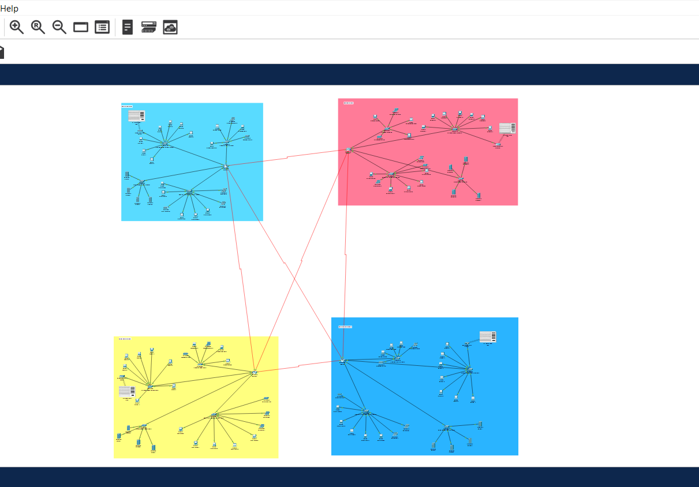
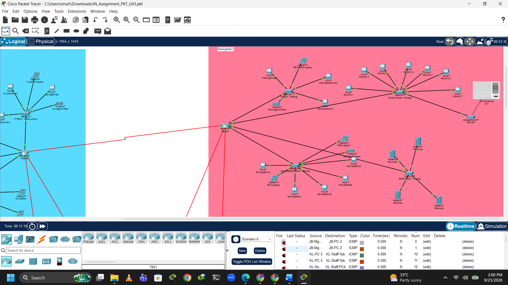

# SkyNetix — Enterprise Multi-Branch Network

A four-branch enterprise network designed and simulated in Cisco Packet Tracer, demonstrating structured LAN/WAN architecture, VLSM-based IPv4 addressing, static routing, and end-to-end network connectivity.

## Network Topology

*Complete four-branch enterprise network topology.*

### Penang Branch

*Detailed view of the Penang branch network.*

## Project Overview

SkyNetix connects four geographically separated branch offices through a routed WAN:

- Kuala Lumpur — Headquarters
- Penang — Regional Branch
- Johor Bahru — Regional Branch
- Kota Kinabalu — Regional Branch

Each branch contains departmental LANs for Finance, Administration, IT, and server resources. The branch routers are interconnected through point-to-point WAN links to enable communication across the complete network.

## Network Architecture

The network uses a star-based LAN structure within each branch. End devices connect to departmental switches, while each branch router provides connectivity between local subnets and remote branch networks.

The four branch routers are interconnected through a WAN ring:

`Kuala Lumpur → Penang → Johor Bahru → Kota Kinabalu → Kuala Lumpur`

## IP Addressing & VLSM

The network is designed using the `200.168.30.0/24` address space with Variable Length Subnet Masking (VLSM).

| Network Purpose | Prefix | Usable Hosts |
|---|---:|---:|
| Finance / Administration | /28 | 14 |
| IT / Server Networks | /29 | 6 |
| WAN Point-to-Point Links | /30 | 2 |

### Branch Address Blocks

| Branch | Address Block |
|---|---|
| Kuala Lumpur | `200.168.30.0/26` |
| Penang | `200.168.30.64/26` |
| Johor Bahru | `200.168.30.128/26` |
| Kota Kinabalu | `200.168.30.192/26` |

## WAN Addressing

| Connection | Subnet |
|---|---|
| Kuala Lumpur ↔ Penang | `200.168.30.240/30` |
| Penang ↔ Johor Bahru | `200.168.30.244/30` |
| Johor Bahru ↔ Kota Kinabalu | `200.168.30.248/30` |
| Kota Kinabalu ↔ Kuala Lumpur | `200.168.30.252/30` |

## Routing

Static routing is configured on the branch routers to provide reachability between remote LANs. Each departmental subnet uses its corresponding router interface as the default gateway.

## Network Services & Devices

The simulated environment includes:

- Cisco routers and switches
- PCs and laptops
- Network printers
- Web, DNS, mail and file servers
- Wireless and IoT devices
- Point-to-point WAN connections

## Testing & Validation

Network connectivity was validated in Cisco Packet Tracer using ICMP testing. Testing included communication within individual branches and between devices located in different branches.

The validation process covered:

- Intra-branch connectivity
- Inter-branch connectivity
- Default gateway configuration
- WAN connectivity
- Static route verification
- Troubleshooting and retesting

## Technologies & Skills

`Cisco Packet Tracer` `IPv4` `VLSM` `Subnetting` `Static Routing` `LAN/WAN` `Network Design` `ICMP` `Network Troubleshooting`

## Project Files

- **SkyNetix.pkt** — Complete Cisco Packet Tracer simulation
- **SkyNetix_Enterprise_Network_Design_Final.pdf** — Detailed network design and technical documentation

## Potential Improvements

Future enhancements could include VLAN-based department segmentation, ACL implementation, dynamic routing, redundant network paths, and additional network security controls.
